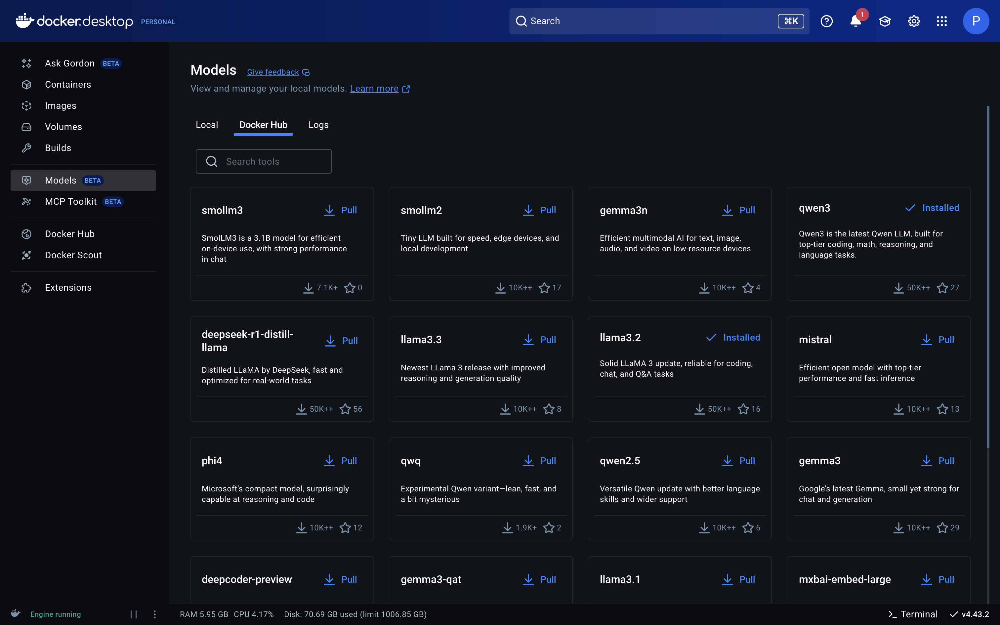
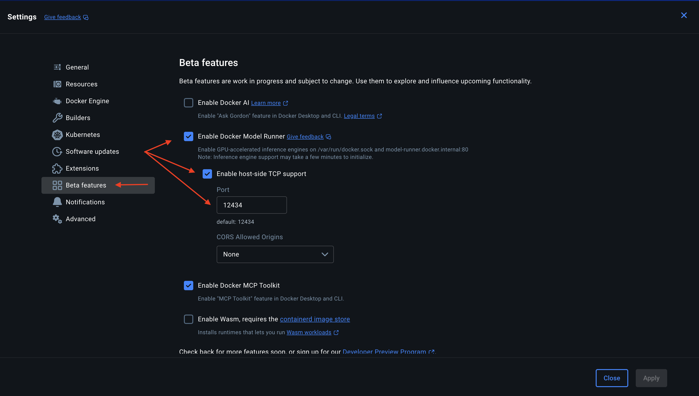

# LLM Chatbot (Code Review, Generation, Debugging, and More)

This project is a lightweight, developer-friendly chatbot powered by **Docker Model Runner** (e.g. LLaMA 3.2 or other local models), styled like ChatGPT, with support for:

* **Code Review**
* **Code Generation**
* **General Q\&A**
* **Debugging**
* **Optimization**

It runs fully locally via **Docker + Flask**, with markdown rendering, streaming response, copy buttons, and multiple modes.

---

## Features

* Dark-mode responsive UI with Tailwind
* Markdown + code block rendering
* Upload file support (+ icon)
* Streamed assistant typing effect
* Multiple endpoints and prompts (review, generate, debug...)
* Runs entirely on Docker (LLM + app)

---

## Project Structure

```
llm-chatbot/
├── app.py                # Flask entry
├── routes/              # Route handlers
│   └── chat_routes.py
├── services/            # Chat logic
│   └── llama_runner.py
├── templates/
│   ├── index.html       # Mode selector
│   └── chat.html        # Chat UI
├── .env                 # Copied from .env.example
├── .env.example         # Sample environment file
├── requirements.txt
└── demo/
    └── <your-screenshots-here>.png
```

---

## Getting Started

### 1. Prerequisites

* Docker Desktop
* Docker Model Runner plugin

---

## 🔌 How to Add Models

### 🐳 A. From Docker Desktop GUI (One-Click)

1. Open Docker Desktop
2. Click **"Add Model"**
3. Use the dropdown and select **any model** like:
   * `ai/llama3.2`
   * `ai/qwen3`
4. Click **“Pull”** and wait for it to finish.

> 💡 Tip: Docker Model Runner currently **only supports GGUF models that are single-sharded** (not split into multiple files).



To enable TCP connection for the model runner (required for API communication):

1. Go to **Settings > Features in Development**
2. Enable **Model Runner TCP support**



---

### 🤗 B. From Hugging Face

You can also find compatible models manually:

1. Go to [HuggingFace Models](https://huggingface.co/models)

2. Filter:

   * **Format**: `GGUF`
   * **Library**: `Docker Model Runner`
   * **Parameter Range**: `1B – 9B` *(models above 9B are often multi-shard and unsupported)*

3. Choose a model like:

   * `unsloth/Kimi-K2-Instruct-GGUF`
   * `TheBloke/Qwen1.5-7B-GGUF`
   * `NousResearch/Nous-Hermes-2-Mistral-7B-GGUF`

4. Copy the full pull command from the model card (example):

```bash
docker model pull hf.co/TheBloke/Qwen1.5-7B-GGUF:Q4_K_M
```

---

### 🧰 CLI: Install Model Runner (First Time Only)

```bash
docker extension install docker/model:latest
```

Then enable TCP:

```bash
docker model install-runner --tcp 12434
```

Or in Docker Desktop:

1. Go to **Settings > Features in Development**
2. Enable **Model Runner TCP support**

---

## 🚀 Run It (Local Dev)

```bash
docker compose up -d
```

Then open: [http://localhost:12345](http://localhost:12345)

---

## 🔧 .env

```bash
cp .env.example .env
```

---

## 📄 requirements.txt

```txt
flask
requests
python-dotenv
```

---

## ✅ Features to Explore

* [ ] Add Chat History (localStorage?)
* [ ] Auth or Login (JWT, sessions)
* [ ] Save/Share prompts

---

## 🧐 Credits

* Powered by Docker Model Runner

---

## 📜 License

MIT. Use freely. Attribution appreciated.
